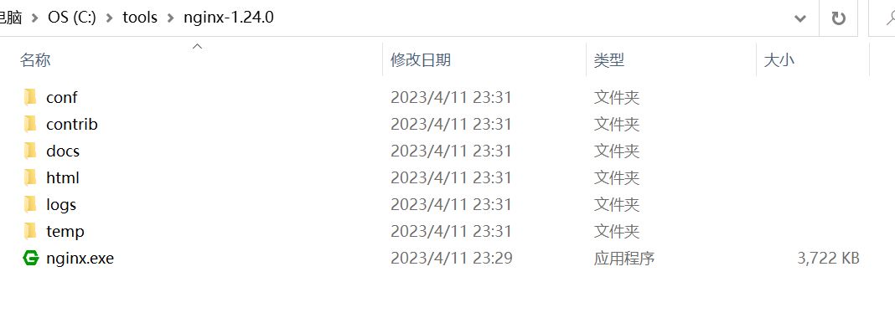
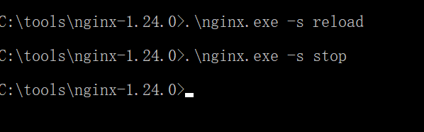
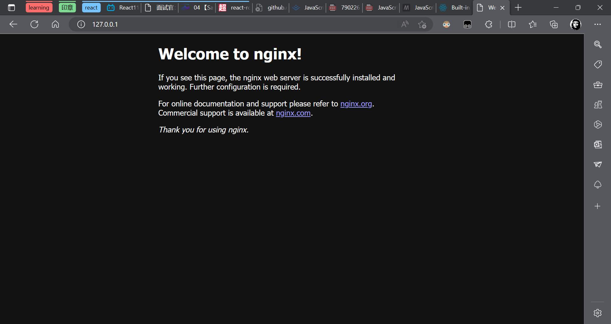

# 启动



点击`nginx.exe`启动服务

# 停止&重启服务




重启： `.\nginx.exe -s reload`

停止：`.\nginx.exe -s stop`


# 服务成功启动




# nginx根目录


`html`为服务器的根目录，项目打包后的代码都放在html下


# 修改服务器的配置

修改服务器的配置，将所有请求都转发到index.html

修改服务器映射规则，将所有的请求交给React/Vue框架处理，禁止服务器自动匹配页面。以nginx为例，可以将`nginx.conf`中的配置信息修改如下：

```nginx
location / {
    root   html;
    # index  index.html index.htm; # 注释
    try_files $uri /index.html;
}
```

