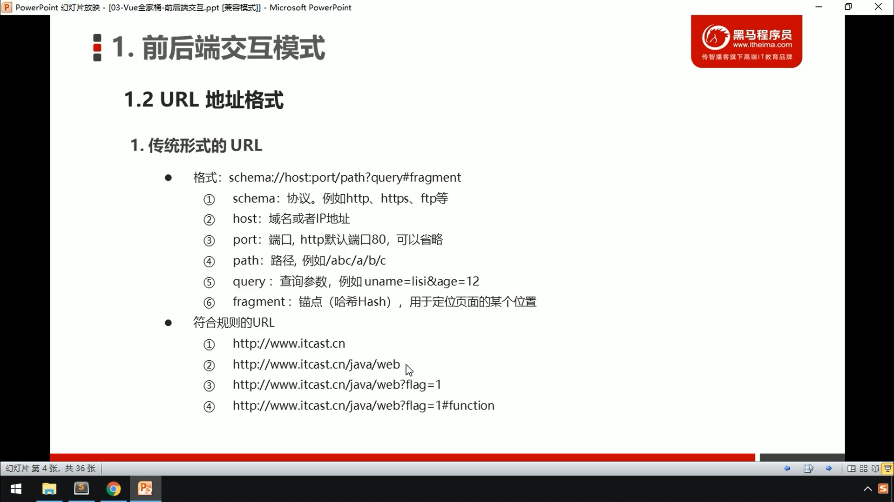
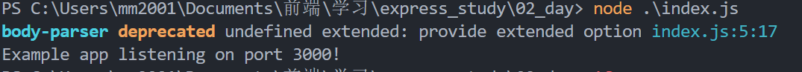
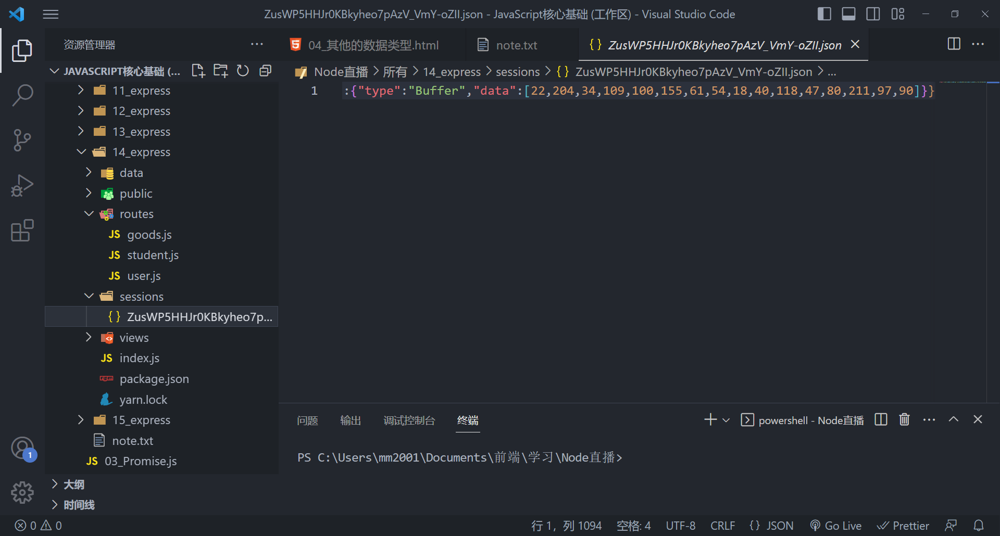

# nodejs

## 简介

[中文官网](http://dev.nodejs.cn/learn) 

[nodejs英文文档：](https://nodejs.dev/en/)

Node.js 是一个开源和跨平台的 JavaScript 运行时环境。 它几乎是任何类型项目的流行工具！

Node.js 在浏览器之外运行 **V8 JavaScript 引擎**（Google Chrome 的内核）。 这使得 Node.js 的性能非常好。

Node.js 应用程序在**单个进程**中运行，无需为每个请求创建新的线程。 Node.js 在其标准库中提供了一组**异步**的 I/O 原语，以防止 JavaScript 代码阻塞，通常，Node.js 中的库是使用**非阻塞**范式编写的，使得阻塞行为成为异常而不是常态。

当 Node.js 执行 I/O 操作时（比如从网络读取、访问数据库或文件系统），Node.js 将在响应返回时恢复操作（而不是阻塞线程和浪费 CPU 周期等待）。

这允许 Node.js 使用单个服务器处理数千个并发连接，而不会引入管理线程并发（这可能是错误的重要来源）的负担。

Node.js 具有独特的优势，因为数百万为浏览器编写 JavaScript 的前端开发者现在无需学习完全不同的语言，就可以编写除客户端代码之外的服务器端代码。

在 Node.js 中，可以毫无问题地使用新的 ECMAScript 标准，因为你不必等待所有用户更新他们的浏览器，你负责通过更改 Node.js 版本来决定使用哪个 ECMAScript 版本，你还可以通过运行带有标志的 Node.js 来启用特定的实验性功能。


**总结**

​    \- 运行在服务器端的js

​    \- 用来编写服务器

​    \- **特点**：

​        \- 单线程、异步、非阻塞

​        \- 统一API

## nvm安装

​        \- **命令**

​            **nvm list** - **显示已安装的node版本**

​            **nvm install 版本** - **安装指定版本的node**

​			**nvm uninstall 版本 - 卸载指定版本的node**

​            配置nvm的**镜像服务器**

```bash
-> nvm node_mirror https://npmmirror.com/mirrors/node/
```
​            **nvm use 版本** - **指定要使用的node版本**


​    **node.js和JavaScript有什么区别**

​        ECMAScript（node有） DOM（node没有） BOM（node没有）


## 同步异步

### 进程和线程

​        \- **进程**（厂房）

​            \- 程序的**运行的环境**

​        \- **线程**（工人）

​            \- 线程是**实际进行运算的东西**


###     同步

​        \- 通常情况代码都是自上向下一行一行执行的

​        \- 前边的代码不执行后边的代码也不会执行

​        \- 同步的代码执行会出现阻塞的情况

​        \- 一行代码执行慢会影响到整个程序的执行


​    解决同步问题：

​        \- java python

​            \- 通过多线程来解决

​        \- node.js

​            \- 通过异步方式来解决


###     异步

​        \- **一段代码的执行不会影响到其他的程序**

​        \- 异步的问题：

​            **异步的代码无法通过return来设置返回值**

​        \- 特点：

​            1.**不会阻塞其他代码的执行**

​            2.**需要通过回调函数来返回结果**

​        \- 基于回调函数的异步带来的问题

​            \1. 代码的可读性差

​            \2. 可调试性差

​        \- 解决问题：

​            \- 需要一个东西，可以代替回调函数来给我们返回结果

​            \- Promise横空出世

​                \- **Promise**是一个可以**用来存储数据的对象**

​                    Promise存储数据的方式比较特殊，

​                    这种特殊方式使得Promise可以用来**存储异步调用的数据**


​    \- 现实生活

​        1.点菜

​        2.厨师做菜

​        3.吃

```js
function sum(a, b, cb) {
    setTimeout(() => {
        cb(a + b)
    }, 1000)
}

function sum2(a, b){
    const begin = Date.now()

    // 让程序停10秒
    while(Date.now() - begin < 10000){}
}

console.log("111111")

sum(123, 456, (result)=>{
    sum(result, 7, (result)=>{
        sum(result, 8, result => {
            sum(result, 9, result => {
                sum(result, 10, result => {
                    console.log(result)
                })
            })
        })
    })
})

console.log("222222")
```


## Promise

### 介绍

异步调用必须要通过回调函数来返回数据，

​        当我们进行一些复杂的调用的时，会出现“回调地狱”

问题：

​        异步必须通过回调函数来返回结果，回调函数一多就很痛苦

**Promise**

​        \- Promise可以帮助我们解决异步中的回调函数的问题

​        \- **Promise就是一个用来存储数据的容器**

​            它拥有着一套特殊的存取数据的方式

​            这个方式使得它里边**可以存储异步调用的结果**


### 创建Promise

创建Promise时，**构造函数中需要一个函数作为参数**。

Promise构造函数的**回调函数**，它会在创建Promise时调用，调用时会有**两个参数传递**进去

**resolve** 和 **reject** 是两个函数，通过这两个函数可以**向Promise中存储数据**。

**resolve在执行正常时存储数据**，**reject在执行错误时存储数据**。

通过函数来向Promise中添加数据，好处就是可以用来添加异步调用的数据


### 从Promise中读取数据

​        \- 可以通过Promise的**实例方法then**来读取Promise中存储的数据

​        \- then需要两个回调函数作为参数，回调函数用来获取Promise中的数据

​            通过**resolve存储的数据，会调用第一个函数返回**，

​                可以在第一个函数中编写处理数据的代码


​            通过**reject存储的数据或者出现异常时，会调用第二个函数返回**，

​                可以在第二个函数中编写处理异常的代码

```js
const promise = new Promise((resolve, reject) => {
    // setTimeout(() => {
    //     resolve("哈哈")
    // }, 2000)

    // throw new Error("哈哈，出错了")

    resolve("resolve返回的数据")
    // reject("reject返回的数据")
})

console.log(promise)

promise.then((result) => {
     console.log("1", result)
}, (reason) => {
     console.log("2", reason)
})
```

### Promise中维护了两个隐藏属性：

​        **PromiseResult**

​            \- **用来存储数据**


​        **PromiseState**

​            \- **记录Promise的状态（三种状态）**

​                **pending**   （进行中）

​                **fulfilled**（完成） 通过resolve存储数据时

​                **rejected**（拒绝，出错了） 出错了或通过reject存储数据时

​            \- **state只能修改一次，修改以后永远不会在变**。

​    

### 流程：

​            当Promise创建时，**PromiseState初始值为pending**，

​                当通过**resolve存储数据时 PromiseState 变为fulfilled（完成）**

​                    PromiseResult变为存储的数据

​                当通过**reject存储数据或出错时 PromiseState 变为rejected（拒绝，出错了）**

​                    PromiseResult变为存储的数据 或 异常对象


​            当我们通过then读取数据时，相当于为Promise设置了回调函数，

​                如果**PromiseState变为fulfilled**，则调用then的第一个回调函数来返回数据

​                如果**PromiseState变为rejected**，则调用then的第二个回调函数来返回数据

### cath,finally

​    **catch**() 用法和then类似，但是只需要一个回调函数作为参数

​        catch()中的回调函数只会**在Promise被拒绝时才调用**

​        catch() **相当于 then(null, reason => {})**

​        catch() 就是一个**专门处理Promise异常的方法**


​    **finally**() 

​        \- **无论是正常存储数据还是出现异常了，finally总会执行**

​        \- 但是finally的**回调函数中不会接收到数据**

​        \- finally()通常用来编写一些无论成功与否都要执行代码

   ```js
const promise2 = new Promise((resolve, reject) => {
    resolve("哈哈")
})

// console.log(promise2)
promise2.then(result => {
    console.log(result)
}, reason => {
    console.log("出错了")
})

promise2.catch(reason => {
     console.log(222222)
})

promise2.finally(()=>{
    console.log("没有什么能够阻挡我执行的！")
})

console.log(1111111)
   ```


## Promise进阶

### 详解

Promise就是一个用来**存储数据的对象**

但是由于Promise存取的方式的特殊，所以**可以直接将异步调用的结果存储到Promise中**

对Promise进行**链式调用**时

**后边的方法（then和catch）读取的上一步的执行结果**

**如果上一步的执行结果不是当前想要的结果，则跳过当前的方法**


当Promise出现异常时，而整个调用链中没有出现catch，则异常会向外抛出


 promise中的

​        **then** (return new Promise())

​        **catch**

​        \- 这三个方法都会**返回一个新的Promise**,

​            **Promise中会存储回调函数的返回值**

​        **finally**

​            \- **finally的返回值，不会存储到新的Promise中**

```js
const promise = new Promise((resolve, reject) => {
    reject("周一到周五19点，不见不散") 
})

promise
    .then(r => console.log("第一个then", r))
    .catch(r => {
        throw new Error("报个错玩")
        console.log("出错了")
        return "嘻嘻"
    })
    .then(r => console.log("第二个then", r))
    .catch(r => {
        console.log("出错了")
    })


// promise
//     .then(result => {
//         console.log("回调函数", result)
//         return "锄禾日当午"
//     })
//     .then(result => {
//         console.log("第二个then", result)
//         return "超哥真快乐"
//     })
//     .then(result => {
//         console.log(result)
//     })


// 链式调用，每一个then都返回一个Promise

// promise.then(result => {
//     console.log(result)
// }, reason => {
//     console.log("出错了", reason)
// })

// function sum(a, b, cb) {
//     setTimeout(() => {
//         cb(a + b)
//     }, 1000);
// }

function sum(a, b) {
    return new Promise((resolve, reject) => {
        setTimeout(() => {
            resolve(a + b)
        }, 1000)
    })
}

// sum(123, 456).then(result => {
//     sum(result, 7).then(result =>{
//         sum(result, 8).then(result => {
//             console.log(result)
//         })
//     })
// })

// sum(123, 456)
//     .then(result => result + 7)
//     .then(result => result + 8)
//     .then(result => console.log(result))
```


### 静态方法

| 方法                  | 语法                                                         |
| --------------------- | ------------------------------------------------------------ |
| **resolve**()         | 创建一个立即完成的Promise                                    |
| **reject**()          | 创建一个立即拒绝的Promise                                    |
| **all**([...])        | 同时返回多个Promise的执行结果                                                                                                          **其中有一个报错，就返回错误** |
| **allSettled**([...]) | 同时**返回多个Promise的执行结果(无论成功或失败)**	                                                   {**status**: 'fulfilled', **value**: 579},{**status**: 'rejected', **reason**: '哈哈'} |
| **race**([...])       | **返回执行最快的Promise（不考虑对错）**                      |
| **any**([...])        | **返回执行最快的完成的Promise**                              |

```js
// Promise.resolve(10).then(r => console.log(r))

// Promise.reject("错误")

// new Promise((resolve, reject) => {
//     resolve(10)
// })

function sum(a, b) {
    return new Promise((resolve, reject) => {
        setTimeout(() => {
            resolve(a + b)
        }, 1000)
    })
}


// Promise.all([
//     sum(123, 456),
//     sum(5, 6),
//     Promise.reject("哈哈"),
//     sum(33, 44)
// ]).then(r => {
//     console.log(r)
// })

// Promise.allSettled([
//     sum(123, 456),
//     sum(5, 6),
//     Promise.reject("哈哈"),
//     sum(33, 44)
// ]).then(r => {
//     console.log(r)
// })

// Promise.race([
//     Promise.reject(1111),
//     sum(123, 456),
//     sum(5, 6),
//     sum(33, 44)
// ]).then(r => {
//     console.log(r)
// }).catch(r => {
//     console.log("错误")
// })

// Promise.any([
//     Promise.reject(1111),
//     Promise.reject(2222),
//     Promise.reject(3333),
// ]).then(r => {
//     console.log(r)
// }).catch(r => {
//     console.log("错误", r)
// })

setTimeout(()=>{
    console.log(1111)
})

Promise.resolve()
    .then(() => {
        console.log(2222)
    })


// console.log(22222)
```


## 宏任务微任务

开启了一个定时器
定时器的作用是间隔一段时间后，将函数放入到任务队列中

```js
setTimeout(() => {
    console.log(1)
}, 0)
```

### **Promise的执行原理**

​        \- Promise在执行，then就相当于给Promise了回调函数

​            当Promise的**状态从pending 变为 fulfilled时**，

​                **then的回调函数会被放入到任务队列中**

```js
// Promise.resolve(1).then(() => {
//     console.log(2)
// })

/* 
    queueMicrotask() 用来向微任务队列中添加一个任务
*/

// setTimeout(() => {
//     console.log(1)
// })

// Promise.resolve().then(() => {
//     setTimeout(()=>{
//         console.log(1)
//     })
// })

Promise.resolve().then(() => {
    Promise.resolve().then(()=>{
        console.log(1)
    })
})

queueMicrotask(() => {
    console.log(2)
})

console.log(3)
```


现在有这样一段代码，你能说出它在控制台中的输出结果吗？


```js
console.log(1)

Promise.resolve().then(() => {
    console.log(2)
})

console.log(3)
```

要真正的理解这一段代码，我们必须要先搞懂Promise中的实例方法then到底是在做什么？之前在学习Promise时，我们就已经说过了，then相当于为Promise设置了一个回调函数，当Promise中的数据处理完毕时，便会调用then所设置的回调函数来继续后续任务。

上例中，我们通过Promise.resolve()创建了一个理解完成的Promise，那么按道理讲then中的回调函数应该立刻执行啊？因为Promise已经完成了啊？所以打印的顺序不应该是“1 2 3”吗？如果能想到这些那么证明之前讲解的Promise你已经理解的差不多了，但是还不够准确！

then中的回调函数会在Promise完成后被调用，但是注意并不是立刻就调用，而是采用一种和定时器类似的处理方式，讲函数放入到一个任务队列中，而队列中的代码会在调用栈中的代码执行完毕后才会执行。也就是说then中的代码总是在当前调用栈中的代码执行完后才执行。所以上边代码的输出结果应该为：“1 3 2”

那么问题又来了，如果是这样的代码呢？


```js
setTimeout(()=>{
    console.log(1)
})

Promise.resolve().then(() => {
    console.log(2)
})
```

错误的分析：setTimeout是定时器，它会在一段时间后将函数放入到任务队列中，而我们没有指定时间，也就意味着函数会立刻放入到任务队列中。then同样也是将函数放入到任务队列中，并且这个Promise是一个立即完成的Promise所以函数也是立刻进入任务队列。那么按照执行顺序来讲，定时器在前，then在后，所以定时器中的函数应该先进入队列，队列又是先进先出的，所以应该先1后2。

上边的分析看似合理，实际上是不对的。因为setTimeout和then虽然都将函数放入到队列中，但是却不是同一个队列。为了更合理的处理异步任务，ES标准规定了一个内部的队列“PromiseJobs”，这个队列是专门用来放置由Promise产生的回调函数的（then、catch、finally），这个队列我们通常被称为“微任务队列（microtask queue）”。相对的，setTimeout这些方法是将函数放入到了“宏任务队列（macrotask queue）”。

简单来说，任务队列有两个，宏任务队列和微任务队列。代码执行时，宏任务进入到宏任务队列，微任务进入到微任务队列。那么哪些任务时微任务，哪些任务是宏任务呢？其实大部分的任务都属于宏任务。而微任务通常在代码运行时产生，通常是由Promise所创建的，Promise的then、catch、finally中的回调函数会作为微任务进入到微任务队列中。

JS代码执行时，每一个宏任务执行完毕后，JS引擎会立即执行微任务队列中的所有任务，然后才是执行宏任务队列中的任务。换句话中then中的回调函数（微任务）会先于定时器中的回调函数（宏任务）执行。所以上例中代码的执行结果应该为：“2 1”。

如果上边的内容你理解了，可以尝试分析一下这段代码：

### 练习

```js
    // 阅读下列代码，并说出执行结果：
    
    console.log(1);

    setTimeout(() => console.log(2));

    Promise.resolve().then(() => console.log(3));

    Promise.resolve().then(() => setTimeout(() => console.log(4)));

    Promise.resolve().then(() => console.log(5));

    setTimeout(() => console.log(6));

    console.log(7);
```

### 总结

​    **JS是单线程**的，它的运行时基于**事件循环机制（event loop）**

​        \- **调用栈**

​            \- **栈**

​                栈是一种数据结构，**后进先出**

​            \- **调用栈**中，放的是**要执行的代码**

​        \- **任务队列**

​            \- **队列**

​                \- 队列是一种数据结构，**先进先出**

​            \- 任务队列的是**将要执行的代码**

​            \- 当调用栈中的代码执行完毕后，队列中的代码才会按照顺序依次进入到栈中执行

​            \- 在JS中任务队列有两种

​                \- **宏任务队列** （大部分代码都去宏任务队列中去排队）

​                \- **微任务队列** （**Promise的回调函数（then、catch、finally**））

​            \- 整个流程

​                ① **执行调用栈中的代码**

​                ② **执行微任务队列中的所有任务**

​                ③ **执行宏任务队列中的所有任务**


## 手写Promise

### 注意

- this指向问题，resolve是函数调用，node没有全局window，所有this是undefined
  - 通过**箭头函数声明私有方法**，或者**bind锁死this**

```js
/* 
    定义类的思路
        1. 先把功能都分析清楚了，在动手
        2. 写一点想一点，走一步看一步
*/

const PROMISE_STATE = {
    PENDING: 0,
    FULFILLED: 1,
    REJECTED: 2
}

class MyPromise {

    // 创建一个变量用来存储Promise的结果
    #result
    // 创建一个变量来记录Promise的状态
    #state = PROMISE_STATE.PENDING //pending 0 fulfilled 1 rejected 2

    // 创建一个变量来存储回调函数
    // 由于回调函数可能有多个，所以我们使用数组来存储回调函数
    #callbacks = []

    constructor(executor) {
        // 接收一个 执行器 作为参数
        executor(this.#resolve.bind(this), this.#reject.bind(this)) // 调用回调函数
    }

    // 私有的resolve() 用来存储成功的数据
    #resolve(value) {
        // 禁止值被重复修改
        // 如果state不等于0，说明值已经被修改 函数直接返回
        if (this.#state !== PROMISE_STATE.PENDING) return

        this.#result = value
        this.#state = PROMISE_STATE.FULFILLED // 数据填充成功

        // 当resolve执行时，说明数据已经进来了，需要调用then的回调函数
        queueMicrotask(() => {
            // 调用callbacks中的所有函数
            this.#callbacks.forEach(cb => {
                cb()
            })
        })
    }

    // #resolve = () => {
    //     console.log(this)
    // }

    // 私有的reject() 用来存储拒绝的数据
    #reject(reason) { }


    // 添加一个用来读取数据的then方法
    then(onFulfilled, onRejected) {

        /* 
            谁将成为then返回的新Promise中的数据？？？
                then中回调函数的返回值，会成为新的Promise中的数据
        */

        return new MyPromise((resolve, reject) => {
            if (this.#state === PROMISE_STATE.PENDING) {
                // 进入判断说明数据还没有进入Promise，将回调函数设置为callback的值
                // this.#callback = onFulfilled
                
                // 箭头函数是为了onFulfilled返回值直接给resolve
                this.#callbacks.push(() => {
                    resolve(onFulfilled(this.#result))
                    
                })
            } else if (this.#state === PROMISE_STATE.FULFILLED) {
                /* 
                    目前来讲，then只能读取已经存储进Promise的数据，
                        而不能读取异步存储的数据
                */
                // onFulfilled(this.#result)

                /* 
                    then的回调函数，应该放入到微任务队列中执行，而不是直接调用
                */
                queueMicrotask(() => {
                    resolve(onFulfilled(this.#result))
                })
            }

        })
    }


}

const mp = new MyPromise((resolve, reject) => {
    setTimeout(() => {
        resolve("孙悟空")
    }, 1000)
})

mp.then((result) => {
    console.log("读取数据1", result)
    return "猪八戒"
}).then(r => {
    console.log("读取数据2", r)
    return "沙和尚"
}).then(r => {
    console.log("读取数据3", r)
})


// const p = Promise.resolve('孙悟空')

// p.then(r => console.log("第一次读", r))
// p.then(r => console.log("第二次读", r))
```

## 答疑

​    js中的变量

​        \- 早期我的理解（错误的）

​            基本数据类型（存值）

​            引用数据类型（存地址）


​        \- **实际情况（v8引擎 chrome）**

​            \- **所有的值在变量中存储的都是内存地址**

​            \- **JS中全都是引用数据类型**

​            \- **JS中的数据类型**

​                \- **原始值**（**不可变类型**）

​                \- **对象**（**可变类型**）

​        

​        \- 为什么？

​            \- **JS是一门动态类型语言，变量是没有类型的**

​            \- 要如何为变量分配内存空间呢？

​            \- JS的解决方案就是变量中只存地址

            ```js
        let a = 10
        a = "hello"
        a = {}
        a = function(){}
            ```


## async、await

```js
/* 
    通过async可以快速的创建异步函数
*/
function fn() {
    return Promise.resolve(10)
}

/* 
    通过async可以来创建一个异步函数
        异步函数的返回值会自动封装到一个Promise中返回
    
    在async声明的异步函数中可以使用await关键字来调用异步函数
*/
async function fn2() {
    return 10
}

// fn().then(r => {
//     console.log(r)
// })

// fn2().then(r => {
//     console.log(r)
// })

function sum(a, b) {
    return new Promise(resolve => {
        setTimeout(() => {
            resolve(a + b)
        }, 2000);
    })
}

/* 
    Promise解决了异步调用中回调函数问题，
        虽然通过链式调用解决了回调地狱，但是链式调用太多以后还是不好看
        我多想以同步的方式去调用异步的代码
*/

async function fn3() {
    // sum(123, 456)
    //     .then(r => sum(r, 8))
    //     .then(r => sum(r, 9))
    //     .then(r => console.log(r))

    // 当我们通过await去调用异步函数时，它会暂停代码的运行
    //  直到异步代码执行有结果时，才会将结果返回
    // 注意 await只能用于 async声明的异步函数中，或es模块的顶级作用域中
    // await阻塞的只是异步函数内部的代码，不会影响外部代码
    // 通过await调用异步代码时，需要通过try-catch来处理异常

    try {
        let result = await sum(123, 456)
        result = await sum(result, 8)
        result = await sum(result, 9)
        console.log(result)
    } catch (e) {
        console.log("出错了~~")
    }

}

// fn3()
// console.log("全局中的输出~~")

// 如果async声明的函数中没有写await，那么它里边就会依次执行
/* 
async function fn4(){
    console.log(1)
    console.log(2)
    console.log(3)
}

function fn5(){
    return new Promise(resolve => {
        console.log(1)
        console.log(2)
        console.log(3)
        resolve()
    })
} 

*/


async function fn4() {
    console.log(1)
    /* 
        当我们使用await调用函数后，当前函数后边的所有代码
            会在当前函数执行完毕后，被放入到微任务队里中
    */
    await console.log(2)

    // await后边的所有代码，都会放入到微任务队列中执行
    // 等同于then的回调函数里的queueMicrotask放进微任务队列里
    console.log(3)
}

function fn5() {
    return new Promise(resolve => {
        console.log(1)
        // 加了await
        console.log(2)

        resolve()
    }).then(r => {
        console.log(3)
    })
}
fn5()

    // console.log(4)


    // async function fn6(){
    //     await console.log("哈哈")
    // }
    // fn6()

;(async () => {
    await console.log("哈哈")
})()
```


# 模块化


## 介绍

[模块化详细文档](https://www.lilichao.com/index.php/2022/10/18/%e6%a8%a1%e5%9d%97%e5%8c%96/)


​    早期的网页中，是没有一个实质的模块规范的

​        我们实现模块化的方式，就是最原始的通过script标签来引入多个js文件

​        问题：

​            \1. 无法选择要引入模块的哪些内容

​            \2. 在复杂的模块场景下非常容易出错

​            ......

​        于是，我们就继续在js中引入一个模块化的解决方案


​    **在node中，默认支持的模块化规范叫做CommonJS，**

​        **在CommonJS中，一个js文件就是一个模块**


## CommonJS规范

### \- 引入模块

​            \- 使用**require("模块的路径")**函数来引入模块

​            \- **引入自定义模块时**

​                \- 模块名要以**./ 或 ../**开头

​                \- **扩展名可以省略**

​                    \- 在CommonJS中，如果省略的js文件的扩展名

​                        node，会自动为文件补全扩展名

​                            ./m1.js 如果没有js 它会寻找 ./m1.json

​                            **js --> json --> node（特殊）**

​            \- **引入核心模块时**

​                \- 直接写核心模块的名字即可

​                \- 也可以在核心模块前添加 **node:**

```js
const m1 = require("./m1")
// const path = require("path")
const path = require("node:path")

const m2 = require("./m2.cjs")

// 如果文件夹，默认index.js为主模块
const hello = require("./hello") // ./hello/index.js

// console.log(m1)
// m1.c()

console.log(hello)
```

**解构赋值引入**

```js
// const obj = require("./m3")

// const name = require("./m3").name

const {name, age, gender} = require("./m3")

console.log(name, age, gender)
```


###     暴露模块内容

在定义模块时，**模块中的内容默认是不能被外部看到的**

​        可以通过**exports来设置要向外部暴露的内容**

​    访问exports的方式有两种：

​        **exports**

​        **module.exports**

​        \- **当我们在其他模块中引入当前模块时，require函数返回的就是exports**

​        \- **可以将希望暴露给外部模块的内容设置为exports的属性**

```js
/* m1.js */

// console.log(exports)
// console.log(module.exports)

// 随意的编写代码


// 可以通过exports 一个一个的导出值
// exports.a = "孙悟空"
// exports.b = {name:"白骨精"}
// exports.c = function fn(){
//     console.log("哈哈")
// }

// 也可以直接通过module.exports同时导出多个值
module.exports = {
    a: "哈哈",
    b: [1, 3, 5, 7],
    c: () =>{
        console.log(111)
    }
}
```

**cjs为扩展名，表示是一个CommonJS标准的模块**

node中默认.js是commonjs标准的模块化

```js
/* m2.cjs */

exports.a = "哈哈"
```


**所有的CommonJS的模块都会被包装到一个函数中**

可以使用console.log(arguments);检验是否是在函数中

commonjs实质就是闭包

```js
/*
	(function(exports, require, module, __filename, __dirname) {
    	// 模块代码会被放到这里
	});
*/

let a = 10
let b = 20

// console.log(__filename) // __filename表示当前模块的绝对路径

console.log(__dirname) // 当模块所在目录的路径
```


## ES6模块化规范

默认情况下，node中的模块化标准是CommonJS

​        要想使用ES的模块化，可以采用以下两种方案

​            \1. 使用mjs作为扩展名

​            \2. 修改package.json将模块化规范设置为ES模块

​                当我们设置 "type": "module" 当前项目下所有的js文件都默认为es module

### 导出

```js
/* 
	m4.mjs
    ES 模块化
*/

// 向外部导出内容
export let a = 10
export const b = "孙悟空"
export const c = { name: "猪八戒" }

// 设置默认导出， 一个模块中只有一个默认导出
// export default function sum(a, b) {
//     return a + b
// }
let d = 20
export default d 
```

### 导入

```js
/* 
	index.mjs
*/

// console.log(module)


// 导入m4模块，es模块不能省略扩展名（官方标准）
// import { a, b, c } from "./m4.mjs"

// 通过as来指定别名
// import { a as hello, b, c } from "./m4.mjs"

// 开发时要尽量避免import * 情况
// import * as m4 from "./m4.mjs"

// console.log(m4.c)

// 导入模块的默认导出
// 默认导出的内容，可以随意命名
// import sum, { a } from "./m4.mjs"

// console.log(sum, a)

import { a, b, c } from "./m4.mjs"

// 通过ES模块化，导入的内容都是常量
// es模块都是运行在严格模式下的
// ES模块化，在浏览器中同样支持，但是通常我们不会直接使用
//          通常都会结合打包工具使用
console.log(c)

c.name = "沙和尚"

console.log(c)
```


## [ES6 模块与 CommonJS 模块的差异](https://juejin.cn/post/7002007274877091870)

讨论 Node.js 加载 ES6 模块之前，必须了解 ES6 模块与 CommonJS 模块完全不同。

它们有三个重大差异。

- CommonJS 模块输出的是一个值的拷贝，ES6 模块输出的是值的引用。
- CommonJS 模块是运行时加载，ES6 模块是编译时输出接口。
- CommonJS 模块的`require()`是同步加载模块，ES6 模块的`import`命令是异步加载，有一个独立的模块依赖的解析阶段。

第二个差异是因为 CommonJS 加载的是一个对象（即`module.exports`属性），该对象只有在脚本运行完才会生成。而 ES6 模块不是对象，它的对外接口只是一种静态定义，在代码静态解析阶段就会生成。

下面重点解释第一个差异。

CommonJS 模块输出的是值的拷贝，也就是说，一旦输出一个值，模块内部的变化就影响不到这个值。请看下面这个模块文件`lib.js`的例子。

```javascript
// lib.js
var counter = 3;
function incCounter() {
  counter++;
}
module.exports = {
  counter: counter,
  incCounter: incCounter,
};
```

上面代码输出内部变量`counter`和改写这个变量的内部方法`incCounter`。然后，在`main.js`里面加载这个模块。

```javascript
// main.js
var mod = require('./lib');

console.log(mod.counter);  // 3
mod.incCounter();
console.log(mod.counter); // 3
```

上面代码说明，`lib.js`模块加载以后，它的内部变化就影响不到输出的`mod.counter`了。这是因为`mod.counter`是一个原始类型的值，会被缓存。除非写成一个函数，才能得到内部变动后的值。

```javascript
// lib.js
var counter = 3;
function incCounter() {
  counter++;
}
module.exports = {
  get counter() {
    return counter
  },
  incCounter: incCounter,
};
```

上面代码中，输出的`counter`属性实际上是一个取值器函数。现在再执行`main.js`，就可以正确读取内部变量`counter`的变动了。

```bash
$ node main.js
3
4
```

ES6 模块的运行机制与 CommonJS 不一样。JS 引擎对脚本静态分析的时候，遇到模块加载命令`import`，就会生成一个只读引用。等到脚本真正执行时，再根据这个只读引用，到被加载的那个模块里面去取值。换句话说，ES6 的`import`有点像 Unix 系统的“符号连接”，原始值变了，`import`加载的值也会跟着变。因此，ES6 模块是动态引用，并且不会缓存值，模块里面的变量绑定其所在的模块。

还是举上面的例子。

```javascript
// lib.js
export let counter = 3;
export function incCounter() {
  counter++;
}

// main.js
import { counter, incCounter } from './lib';
console.log(counter); // 3
incCounter();
console.log(counter); // 4
```

上面代码说明，ES6 模块输入的变量`counter`是活的，完全反应其所在模块`lib.js`内部的变化。

再举一个出现在`export`一节中的例子。

```javascript
// m1.js
export var foo = 'bar';
setTimeout(() => foo = 'baz', 500);

// m2.js
import {foo} from './m1.js';
console.log(foo);
setTimeout(() => console.log(foo), 500);
```

上面代码中，`m1.js`的变量`foo`，在刚加载时等于`bar`，过了 500 毫秒，又变为等于`baz`。

让我们看看，`m2.js`能否正确读取这个变化。

```bash
$ babel-node m2.js

bar
baz
```

上面代码表明，ES6 模块不会缓存运行结果，而是动态地去被加载的模块取值，并且变量总是绑定其所在的模块。

由于 ES6 输入的模块变量，只是一个“符号连接”，所以这个变量是只读的，对它进行重新赋值会报错。

```javascript
// lib.js
export let obj = {};

// main.js
import { obj } from './lib';

obj.prop = 123; // OK
obj = {}; // TypeError
```

上面代码中，`main.js`从`lib.js`输入变量`obj`，可以对`obj`添加属性，但是重新赋值就会报错。因为变量`obj`指向的地址是只读的，不能重新赋值，这就好比`main.js`创造了一个名为`obj`的`const`变量。

最后，`export`通过接口，输出的是同一个值。不同的脚本加载这个接口，得到的都是同样的实例。

```javascript
// mod.js
function C() {
  this.sum = 0;
  this.add = function () {
    this.sum += 1;
  };
  this.show = function () {
    console.log(this.sum);
  };
}

export let c = new C();
```

上面的脚本`mod.js`，输出的是一个`C`的实例。不同的脚本加载这个模块，得到的都是同一个实例。

```javascript
// x.js
import {c} from './mod';
c.add();

// y.js
import {c} from './mod';
c.show();

// main.js
import './x';
import './y';
```

现在执行`main.js`，输出的是`1`。

```bash
$ babel-node main.js
1
```

这就证明了`x.js`和`y.js`加载的都是`C`的同一个实例。


作者：artist
链接：https://juejin.cn/post/7002007274877091870
来源：稀土掘金
著作权归作者所有。商业转载请联系作者获得授权，非商业转载请注明出处。


## 核心模块

核心模块，是node中自带的模块，可以在node中直接使用

**window 是浏览器的宿主对象** node中是没有的

**global 是node中的全局对象**，作用类似于window

**ES标准下，全局对象的标准名应该是 globalThis**

```js
console.log(globalThis)
```

### process

​            \- **表示当前的node进程**

​            \- **通过该对象可以获取进程的信息，或者对进程做各种操作**

​            \- 如何使用

​                \1. process是一个**全局变量**，可以直接使用

​                \2. 有哪些属性和方法：

​                    **process.exit()**

​                        \- 结束当前进程，终止node

​                    **process.nextTick(callback[, …args])**

​                        \- 将函数插入到 tick队列中

​                        \- tick队列中的代码，会在下一次事件循环之前执行

​                            会在微任务队列和宏任务队列中任务之前执行

​            事件顺序：

​                **调用栈**

​                **tick队列**

​                **微任务队列**

​                **宏任务队列**

```js
// console.log(11111)
// process.exit(0)
// console.log(22222)
// console.log(33333)

setTimeout(() => {
    console.log(1) // 宏任务队列
})

queueMicrotask(() => {
    console.log(2)
}) // 微任务队列

process.nextTick(() => {
    console.log(3) // tick队列
})

console.log(4) // 调用栈
```

### path

​    **path**

​        \- 表示的路径

​        \- 通过path可以用来获取各种路径

​        \- 要使用path，需要先对其进行引入

​        \- **方法**：

​            **path.resolve([…paths])** 

​                \- 用来生成一个**绝对路径**

​                    相对路径：./xxx  ../xxx  xxx

​                    绝对路径：

​                        \- 在计算机本地

​                            c:\xxx

​                            /User/xxxx

​                        \- 在网络中

​                            http://www.xxxxx/...

​                            https://www.xxx/...


​                    \- 如果**直接调用resolve，则返回当前的工作目录**


​                        C:\Program Files\nodejs\node.exe .\03_包管理器\01_path.js

​                        c:\Users\lilichao\Desktop\Node-Course


​                        node .\01_path.js

​                        C:\Users\lilichao\Desktop\Node-Course\03_包管理器

​                        \- 注意，我们**通过不同的方式执行代码时，它的工作目录是有可能发生变化的**


​                \- **如果将一个相对路径作为参数**，

​                    **则resolve会自动将其转换为绝对路径**

​                    **此时根据工作目录的不同，它所产生的绝对路径也不同**


​                \- 一般会将一个**绝对路径作为第一个参数**，

​                    一个**相对路径作为第二个参数**

​                    这样它**会自动计算出最终的路径**

```js
const path = require("node:path")
const result = path.resolve()


// c:\Users\lilichao\Desktop\Node-Course\hello.js
const result = path.resolve("./hello.js")
const result = path.resolve(
    "C:\\Users\\lilichao\\Desktop\\Node-Course\\03_包管理器",
    "../../hello.js")


// 最终形态
// 以后在使用路径时，尽量通过path.resolve()来生成路径
const result = path.resolve(__dirname, "./hello.js")
console.log(result)
```


### fs

​    **fs （File System）**

​        \- fs用来帮助node来操作磁盘中的文件

​        \- 文件操作也就是所谓的**I/O，input output**

​        \- 使用fs模块，同样需要引入


#### 同步和异步读取版fs

```js
const path = require("node:path")
const fs = require("node:fs")
// 把硬盘的数据读到内存当中
/*	
	readFileSync() 同步的读取文件的方法，会阻塞后边代码的执行
	当我们通过fs模块读取磁盘中的数据时，读取到的数据总会以Buffer对象的形式返回
	Buffer是一个临时用来存储数据的缓冲区
 */
// const buf = fs.readFileSync(path.resolve(__dirname, "./hello.txt"))
// console.log(buf.toString())

// readFile() 异步的读取文件的方法
fs.readFile(
     path.resolve(__dirname, "./hello.txt"),
     (err, buffer) => {

         if (err) {
             console.log("出错了~")
         } else {
             console.log(buffer.toString())
         }
     }
)
```

#### promise版fs

```js
const fs = require("node:fs/promises")	// 导入promise版的fs模块

fs.readFile(path.resolve(__dirname, './hello123.txt'))
    .then(res => {
        console.log(res.toString());
    })
    .catch(err => {
        console.log('err');
    });
```

#### async、awiat语法糖版fs

```js
const fs = require("node:fs/promises")
;(async ()=>{
    try{
        const buf=await fs.readFile(path.resolve(__dirname, './hello123.txt'))
        console.log(buf.toString());
    }catch (e){
        console.log("e",e);
    }
})()
```

#### fs的实例方法

| 方法         | 作用                                 |
| ------------ | ------------------------------------ |
| readFile()   | 读取文件                             |
| appendFile() | 创建新文件，或将数据添加到已有文件中 |
| mkdir()      | 创建目录                             |
| rmdir()      | 删除目录                             |
| rm()         | 删除文件                             |
| rename()     | 重命名 **(剪切)**                    |
| copyFile()   | 复制文件**（复制）**                 |

```js
const fs = require("node:fs/promises")
const path = require("node:path")

// fs.appendFile(
//     path.resolve(__dirname, "./hello123.txt"),
//     "超哥讲的真不错"
// ).then(r => {
//     console.log("添加成功")
// })

// 复制一个文件
// C:\Users\lilichao\Desktop\图片\jpg\an.jpg

fs.readFile('C:\\Users\\mm2001\\Pictures\\Snipaste_2021-04-11_01-28-45.jpg')
    .then(buffer => {
         return fs.appendFile(
             // 生成一个绝对路径
            path.resolve(__dirname, './ss.jpg'),
             // 传入buffer数据
            buffer);
    })
    .then(e => {
        console.log('操作结束',e);
    });


fs.mkdir()
```

```js
/*
    mkdir可以接收一个 配置对象作为第二个参数，
        通过该对象可以对方法的功能进行配置
            recursive 默认值为false
                - 设置true以后，会自动创建不存在的上一级目录
*/
// fs.mkdir(path.resolve(__dirname, "./hello/abc"), { recursive: true })
//     .then(r => {
//         console.log("操作成功~")
//     })
//     .catch(err => {
//         console.log("创建失败", err)
//     })

// fs.rmdir(path.resolve(__dirname, "./hello"), { recursive: true })
//     .then(r => {
//         console.log("删除成功")
//     })

fs.rename(
    path.resolve(__dirname, "../an.jpg"),
    path.resolve(__dirname, "./an.jpg")
).then(r => {
    console.log("重命名成功")
})
```


# 包管理器

[npm仓库](https://docs.npmjs.com/cli/v8/commands/)

[包管理器 – 李立超 | lilichao.com](https://www.lilichao.com/index.php/2022/10/21/包管理器/)

## npm

###     **package.json**

​        \- package.json**是包的描述文件**

​        \- node中**通过该文件对项目进行描述**

​        \- 每一个node项目必须有package.json

name（必备）

- 包的名称，可以包含小写字母、_和-

version（必备）

- 包的版本，需要遵从x.x.x的格式
- 规则：
  - 版本从1.0.0开始
  - 修复错误，兼容旧版（补丁）1.0.1、1.0.2
  - 添加功能，兼容旧版（小更新）1.1.0
  - 更新功能，影响兼容（大更新）2.0.0

author

- 包的作者，格式：Your Name <email@example.com>

description

- 包的描述

repository

- 仓库地址（git）

scripts

- 自动脚本

​            \- 可以自定义一些命令

​            \- 定义以后可以直接通过npm来执行这些命令

​            \- start 和 test 可以直接通过 npm start npm test执行

​            \- 其他命令需要通过npm run xxx 执行

通常情况下，我们的自己创建的每一个node项目，都可以被认为是一个包。都应该为其创建package.json描述文件。同时，npm可以帮助我们快速的创建package.json文件。只需要进入项目并输入`npm init`即可进入npm的交互界面，只需根据提示输入相应信息即可。

###     **命令**

​        **npm init 初始化项目**，创建package.json文件（需要回答问题）

​        **npm init -y 初始化项目**，创建package.json文件（所有值都采用默认值）

​        **npm install** 包名 将指定包下载到当前项目中

​            install时发生了什么？

​                ① 将包下载当前项目的**node_modules目录**下

​                ② 会在package.json的**dependencies**属性中添加一个新属性

​                    "lodash": "^4.17.21"

​						**^**是自动匹配最新4.几的小更新版本。

​						**~**自动匹配4.17.几的最新补丁（bug修复）版本

​						*****，最新版本包括大更新

​						没有前缀，**固定版本**

​                ③ 会自动添加package-lock.json文件

​                    帮助加速npm下载的，不用动他


​        **npm install** 自动安装所有依赖


​        **npm install 包名 -g** 全局安装

​            \- 全局安装是将包安装到计算机中

​            \- 全局安装的通常都是一些工具


​        **npm uninstall** 包名 卸载   

​        

​        https://docs.npmjs.com/cli/v8/commands

```js
/* 
    引入从npm下载的包时，不需要书写路径，直接写包名即可
*/
const _ = require("lodash")
// console.log(_)
```


### npm镜像

​        \- npm的仓管的服务器位于国外，有时候并不是那么的好使

​        \- 为了解决这个问题，可以在npm中配置一个镜像服务器

​        \- 镜像的配置：

​            ① 在系统中安装cnpm（我自己不太推荐大家使用）

​                npm install -g cnpm --registry=https://registry.npmmirror.com

​            ② 彻底修改npm仓库地址（我个人习惯的使用方式）

​                npm set registry https://registry.npmmirror.com

​                \- 还原到原版仓库

​                npm config delete registry

​			查看当前仓库注册地址

​				npm config get registry


## yarn pnpm

​    早期的npm存在有很多的问题，

​        所以有很多的厂商尝试着开发了一些代替npm的工具

​        比如 yarn pnpm

​        

​        在之前，这些第三方的工具相较于npm具有的很多的优势

​            但是随着时间的推进，npm也在进行不断的迭代，所以到今天

​            npm和其他工具的差距并不是非常的大

​        

​        和npm相比，yarn下载包的速度会快一些


### yarn（个人习惯用yarn）

​            **安装**

​                corepack enable

​			切换到3版本，当前项目为3，全局还是版本1

​                yarn init -2

​            **镜像配置**

​                yarn config set registry https://registry.npmmirror.com

​                删除配置：

​                    yarn config delete registry

​			**注意**：

> v1.22.19是npm上的最新版，yarn3跟npm不兼容
>
> 运行node，需要前面加	**yarn	node	index.js**

#### 命令

```
yarn init （初始化，创建package.json）

yarn add xxx（添加依赖）

yarn add xxx -D（添加开发依赖）

yarn remove xxx（移除包）

yarn（自动安装依赖）

yarn run（执行自定义脚本）

yarn <指令>（执行自定义脚本）

yarn global add（全局安装）

yarn global remove（全局移除）

yarn global bin（全局安装目录）
```

### pnpm

​            \- 安装

​                npm install -g pnpm

​            

​            \- 镜像

​                pnpm config set registry https://registry.npmmirror.com


​                \- 取消

​                pnpm config delete registry


# http协议

**HTTP协议**
    \- **网络基础**
    \- **网络的服务器基于请求和响应的**
     



​        https:// **协议名**  http ftp ...

​        lilichao.com **域名** domain
​            整个网络中存在着无数个服务器，每一个我服务器都有它自己的唯一标识
​                这个标识被称为 **ip**地址 192.168.1.17，但是ip地址不方便记忆
​                **域名就相当于是ip地址的别名**

​        /hello/index.html
​            **网站资源路径**

## [http是无状态请求](https://www.cnblogs.com/lingyejun/p/9282169.html)

​		无状态指的是**对于请求方的每个请求，接收方都当这次请求是第一次请求**。为什么叫做无状态呢？因为对于请求方而言，每次请求时，接收方就像是失忆了一样，并不会依赖请求方以往的请求所生成的数据作回应。也就是说，就像是**接收方没有保存请求方的状态（数据）**一样，所以叫无状态。

​		无状态并不代表接收方不会保存请求方的任何数据，它**只是不保存与接收方可能的下次请求相关的数据**。所以无状态要求请求方每次请求时，一次性提供与请求相关的全部数据，而不能因为某些数据在以前的请求中提供了，这次请求就不提供了。那么，接收方为什么不保存这些数据呢？原因有很多。一方面，保存这些数据需要空间消耗，另一方面，这会带来编程的负担。

​		无状态要从请求方针对同一操作的不同次请求的请求数据来衡量。如果每次请求都必须携带完整的数据，那才能算作是无状态。

**【注意】**

“每次请求都不会修改接收方的数据”，这指的并不是无状态，而应该称之为只读。只读的请求也一般也是无状态的，不过它们在概念上的侧重点不同。无状态只是代表接收方不会将数据空间来保存请求方的每次请求数据，但如果请求涉及对接收方数据库的更新，那么这个请求并不是只读的。接收方只是不能直接识别这是哪次请求而已，这不代表接收方的数据库不会受到每次请求的影响。

## 	两道面试题

### 1.当在浏览器中输入地址以后发生了什么？

​        https://lilichao.com/hello/index.html

​        ① **DNS解析，获取网站的ip地址**
​        ② **浏览器需要和服务器建立连接（tcp/ip）（三次握手）**
​        ③ **向服务器发送请求（http协议）**
​        ④ **服务器处理请求，并返回响应（http协议）**
​        ⑤ **浏览器将响应的页面渲染**
​        ⑥ **断开和服务器的连接（四次挥手）**

### 2.客户端如何和服务器建立（断开）连接

```
        - 通过三次握手和四次挥手
            - 三次握手（建立连接）
                - 三次握手是客户端和服务器建立连接的过程
                    1. 客户端向服务器发送连接请求
                                    SYN
                    2. 服务器收到连接请求，向客户端返回消息
                                    SYN ACK 
                    3. 客户端向服务器发送同意连接的信息
                                    ACK

            - 四次挥手（断开连接）
                    1. 客户端向服务器发送请求，通知服务器数据发送完毕，请求断开来接
                                    FIN
                    2. 服务器向客户端返回数据，知道了
                                    ACK
                    3. 服务器向客户端返回数据，收完了，可以断开连接
                                    FIN ACK
                    4. 客户端向服务器发数据，可以断开了
                                    ACK
```


请求和响应实际上就是一段数据，只是这段数据需要遵循一个特殊的格式，
    这个特殊的格式由HTTP协议来规定


## TCP/IP 协议族（了解）—— 网络通信

    - TCP/IP协议族中包含了一组协议
        这组协议规定了互联网中所有的通信的细节
        - 网络通信的过程由**四层**组成
        **应用层**
                - 软件的层面，浏览器 服务器都属于应用层
        传输层
                - 负责对数据进行拆分，把大数据拆分为一个一个小包
        网络层
                - 负责给数据包，添加信息
        数据链路层
                - 传输信息

## http协议

\- **HTTP协议就是应用层的协议**，
     用来规定客户端和服务器间通信的报文格式的

### 报文

    - 报文（message）
        - 浏览器和服务器之间通信是基于请求和响应的
            - 浏览器向服务器发送请求（request）
            - 服务器向浏览器返回响应（response）
            - 浏览器向服务器发送请求相当于浏览器给服务器写信
                服务器向浏览器返回响应，相当于服务器给浏览器回信
                这个信在HTTP协议中就被称为报文
            - 而HTTP协议就是对这个报文的格式进行规定
    
        - 服务器
            - 一个服务器的主要功能：
                1.可以接收到浏览器发送的请求报文
                2.可以向浏览器返回响应报文
### 请求报文

        - 请求报文（request）
            - 客户端发送给服务器的报文称为请求报文
            - 请求报文的格式如下：
                请求首行
                请求头
                空行
                请求体
    
                请求首行
                    - 请求首行就是请求报文的第一行
                        GET /index.html?username=sunwukong HTTP/1.1
                        第一部分 get 表示请求的方式，get表示发送的是get请求
                            现在常用的方式就是get和post请求
                            get请求主要用来向服务器请求资源
                            post请求主要用来向服务器发送数据
    
                        第二部分 /index.html?username=sunwukong
                            表示请求资源的路径，
                                ? 后边的内容叫做查询字符串
                                查询字符串是一个名值对结构，一个名字对应一个值
                                    使用=连接，多个名值对之间使用&分割
                                    username=admin&password=123123
                                get请求通过查询字符串将数据发送给服务器
                                    由于查询字符串会在浏览器地址栏中直接显示
                                        所以，它安全性较差
                                        同时，由于url地址长度有限制，所以get请求无法发送较大的数据
    
                                post请求通过请求体来发送数据
                                    - 在chrome中通过 载荷 可以查看
                                    post请求通过请求体发送数据，无法在地址栏直接查看
                                        所以安全性较好
                                    请求体的大小没有限制，可以发送任意大小的数据
    
                                如果你需要向服务器发送数据，能用post尽量使用post
    
                        第三部分
                            HTTP/1.1 协议的版本
    
                请求头
                    - 请求头也是名值对结构，用来告诉服务器我们浏览器的信息
                    - 每一个请求头都有它的作用：
                        Accept 浏览器可以接受的文件类型
                        Accept-Encoding 浏览器允许的压缩的编码
                        User-Agent 用户代理，它是一段用来描述浏览器信息的字符串
    
                空行
                    - 用来分隔请求头和请求体
    
                请求体
                    - post请求通过请求体来发送数据
```http
            请求报文：  
            GET /07_http%E5%8D%8F%E8%AE%AE/01_http%E5%8D%8F%E8%AE%AE.html?username=sunwukong HTTP/1.1
            Accept: text/html,application/xhtml+xml,application/xml;q=0.9,image/avif,image/webp,image/apng,*/*;q=0.8,application/signed-exchange;v=b3;q=0.9
            Accept-Encoding: gzip, deflate, br
            Accept-Language: zh-CN,zh;q=0.9,en;q=0.8,la;q=0.7
            Cache-Control: max-age=0
            Connection: keep-alive
            Host: 127.0.0.1:5500
            If-Modified-Since: Thu, 27 Oct 2022 11:10:28 GMT
            If-None-Match: W/"1b8-1841922e832"
            Referer: http://127.0.0.1:5500/07_http%E5%8D%8F%E8%AE%AE/01_http%E5%8D%8F%E8%AE%AE.html?username=sunwukong
            Sec-Fetch-Dest: document
            Sec-Fetch-Mode: navigate
            Sec-Fetch-Site: same-origin
            Upgrade-Insecure-Requests: 1
            User-Agent: Mozilla/5.0 (Windows NT 10.0; Win64; x64) AppleWebKit/537.36 (KHTML, like Gecko) Chrome/106.0.0.0 Safari/537.36
            sec-ch-ua: "Chromium";v="106", "Google Chrome";v="106", "Not;A=Brand";v="99"
            sec-ch-ua-mobile: ?0
            sec-ch-ua-platform: "Windows"
```


### 响应报文

```html
            响应报文：
                响应首行
                响应头
                空行
                响应体

                响应首行
                    HTTP/1.1 200 OK
                        200 响应状态码
                        ok 对响应状态码的描述
                        - 响应状态码的规则
                            1xx 请求处理中
                            2xx 表示成功
                            3xx 表示请求的重定向
                            4xx 表示客户端错误
                            5xx 表示服务器的错误

                响应头
                    - 响应头也是一个一个的名值对结构，用来告诉浏览器响应的信息
                    - Content-Type 用来描述响应体的类型
                    - Content-Length 用来描述响应体大小
                    Content-Type: text/html; charset=UTF-8
                    Content-Length: 2017
                空行
                    - 空行用来分隔响应头和响应体

                响应体
                    - 响应体就是服务器返回给客户端的内容
                <!DOCTYPE html>
                    <html lang="zh">
                        <head>
                            <meta charset="UTF-8" />
                            <meta http-equiv="X-UA-Compatible" content="IE=edge" />
                            <meta name="viewport" content="width=device-width, initial-scale=1.0" />
                            <title>Document</title>
                        </head>
                        <body>
                            <form method="post" action="./02_target.html">
                                <input type="text" name="username" />
                                <input type="password" name="password" />
                                <button>提交</button>
                            </form>
                    </body>
                    </html>
```

```http
            响应报文：
                HTTP/1.1 200 OK
                Vary: Origin
                Access-Control-Allow-Credentials: true
                Accept-Ranges: bytes
                Cache-Control: public, max-age=0
                Last-Modified: Thu, 27 Oct 2022 11:31:54 GMT
                ETag: W/"20c-18419368696"
                Content-Type: text/html; charset=UTF-8
                Content-Length: 2017
                Date: Thu, 27 Oct 2022 11:52:29 GMT
                Connection: keep-alive
                Keep-Alive: timeout=5
```


# express

## 简介

​    express 是node中的服务器软件

​        通过express可以快速的在node中搭建一个web服务器

​    \- 使用步骤：

​        \1. 创建并初始化项目

​            yarn init -y

​        \2. 安装express

​            yarn add express

​        \3. 创建index.js 并编写代码

```js
// 引入express
const express = require("express")

// 获取服务器的实例（对象）
const app = express()

// 启动服务器
// app.listen(端口号) 用来启动服务器
// 服务器启动后，我们便可以通过3000端口来访问了
// 协议名://ip地址:端口号/路径
// http://localhost:3000
// http://127.0.0.1:3000
app.listen(3000, () => {
    console.log("服务器已经启动~")
})
```

## 路由

在Express 中，路由指的是客户端的请求与服务器处理函数之间的映射关系，

​	即客户端访问服务器的终点为路由


如果希望服务器可以正常访问，则需要为服务器设置路由，

​        **路由可以根据不同的请求方式和请求地址来处理用户的请求**

​    

​        **app.METHOD(...)**

​            METHOD 可以是 get 或 post ...


在路由中，应该做两件事
	**读取用户的请求（request）**
		**req 表示的是用户的请求信息**，**通过req可以获取用户传递数据**
		console.log(**req.ur**l)

​	**根据用户的请求返回响应（response）**
​		res 表示的服务器发送给客户端的响应信息
 		可以**通过res来向客户端返回数据**


| req.url          | 获取url路径与参数                |
| ---------------- | -------------------------------- |
| res.sendStatus() | 向客户端发送响应状态吗           |
| res.status()     | 用来设置响应状态吗，但是并不发送 |
| res.send()       | 设置并发送响应体                 |

```js
// http://localhost:3000
// 		/ 表示根目录
// 路由的回调函数执行时，会接收到三个参数
// 第一个 request 第二个 response
app.get("/hello", (req, res) => {
    console.log("有人访问我了~")

    // res.sendStatus(404)
    // res.status(200)
    res.send("<h1>这是我的第一个服务器</h1>")
})
```

## 中间件

### 什么是Express中间件

​	**中间件特指业务流程的中间处理环节**。

​	当一个请求到达Express 的服务器之后，可以连续调用多个中间件，从而对这次请求进行预处理。

### 中间件

​        \- 在express我们使用app.use来定义一个中间件

​            中间件作用和路由很像，用法很像

​            但是路由不区分请求的方式，只看路径


​        \- 和路由的区别

​            1.**会匹配所有请求**

​            2.**路径设置父目录**

```js
// 可以省略路径，会默认为根目录
app.use((req, res, next) => {
    console.log("111", Date.now())
    res.send("<h1>111</h1>")
})
```

### next

```js
// next() 是回调函数的第三个参数，它是一个函数，调用函数后，可以触发后续的中间件
// next() 不能在响应处理完毕后调用
app.use((req, res, next) => {
    console.log("111", Date.now())
    // res.send("<h1>111</h1>")

    next() // 放行，我不管了~~
})

app.use((req, res, next) => {
    console.log("222", Date.now())
    // res.send("<h1>222</h1>")
    next()
})

app.use((req, res) => {
    console.log("333", Date.now())
    res.send("<h1>333</h1>")
})
```

## nodemon

目前，服务器代码修改后必须要重启，

​        我们希望有一种方式，可以自动监视代码的修改

​        代码修改以后可以自动重启服务器


​    要实现这个功能，我们需要安装一个模块 nodemon

​        使用方式：

​            \1. **全局安装**

​                npm i nodemon -g

​                yarn global add nodemon

​                    \- **同yarn进行全局安装时**，**默认yarn的目录并不在环境变量中**

​                    \- **需要手动将路径添加到环境变量中**

​                \- **启动**：

​                    nodemon  // 运行index.js

​                    nodemon xxx // 运行指定的js


​            \2. **在项目中安装**

​                npm i nodemon -D

​                yarn add nodemon -D


​                \- **启动**

​                    npx nodemon

```json
  // 依赖：项目运行所必须的依赖
  "dependencies": {
    "express": "^4.18.2"
  },
  // 开发依赖：项目开发，调试时所需要的依赖   -D
  "devDependencies": {
    "nodemon": "^2.0.20"
  },
  // 脚本：简写长命令，可以跟详细文件 ./index.js
  // yarn start | npm start
  "scripts": {
    "start": "npx nodemon"
  }
```

## 静态资源

​    服务器中的代码，对于外部来说都是不可见的，

​        所以我们写的html页面，浏览器无法直接访问

​        如果希望浏览器可以访问，则需要将页面所在的目录设置静态资源目录

```js
// 设置static中间件后，浏览器访问时，会自动去public目录寻找是否有匹配的静态资源
// 配置静态资源的路径
// public http://localhost:3000/
app.use(express.static(path.resolve(__dirname, "./public")))
```

```html
    <body>
        <h2>登录</h2>
        <form action="/login" method="get">
            <div>用户名 <input name="username" type="text" /></div>
            <div>密码 <input name="password" type="password" /></div>
            <div>
                <input type="submit" value="登录" />
            </div>
        </form>
        <hr />

        <h1>我是一个网页，一个静态网页</h1>
        
    </body>
```

## query查询字符串

```js
// 添加一个路由，可以读取get请求的参数
// /login -->  http://localhost:3000/login
app.get("/login", (req, res) => {
    // 获取到用户输入的用户名和密码
    // req.query 表示查询字符串中的请求参数
    // console.log(req.query.username)
    // console.log(req.query.password)
    console.log("请求已经收到~~")

    // 验证用户输入的用户名和密码是否正确
    if(req.query.username === "sunwukong" && req.query.password === "123123"){
        res.send("<h1>登录成功！</h1>")
    }else{
        res.send("<h1>用户名或密码错误！</h1>")
    }

})
```

## params

```js
// get请求发送参数的第二种方式
// /hello/:id 表示当用户访问 /hello/xxx 时就会触发
// 在路径中以冒号命名的部分我们称为param，在get请求它可以被解析为请求参数
// param传参一般不会传递特别复杂的参数
// app.get("/hello/:name/:age/:gender", (req, res) => {
app.get("/hello/:name", (req, res) => {
    // 约定由于配置

    // 可以通过req.params属性来获取这些参数
    console.log(req.params)

    res.send("<h1>这是hello路由</h1>")
})
```

## post路由

### 解析请求体

```js
const app = express();
// 解析请求体
app.use(express.urlencoded({extended:true}))
```

默认参数为ture，不带有提示，终端运行的情况下



```js
const express = require("express")
const app = express()
const path = require("path")

// 创建一个数组来存储用户信息
const USERS = [
    {
        username: "admin",
        password: "123123",
        nickname: "超级管理员"
    },
    {
        username: "sunwukong",
        password: "123456",
        nickname: "齐天大圣"
    }
]

// 配置静态资源的路径
// public http://localhost:3000/
app.use(express.static(path.resolve(__dirname, "public")))
// 引入解析请求体的中间件
app.use(express.urlencoded())

app.post("/login", (req, res) => {
    const username = req.body.username
    const password = req.body.password

    // 获取到用户的用户名和密码后，需要根据用户名去用户的数组中查找用户
    // for (const user of USERS) {
    //     if (user.username === username) {
    //         // 用户存在接着检查用户的密码
    //         if (user.password === password) {
    //             // 信息正确，登录成功
    //             res.send(`<h1>登录成功 ${user.nickname}</h1>`)
    //             return
    //         }
    //     }
    // }

    // res.send(`<h1>用户名或密码错误</h1>`)

    const loginUser = USERS.find((item) => {
        return item.username === username && item.password === password
    })

    if (loginUser) {
        res.send(`<h1>登录成功 ${loginUser.nickname}</h1>`)
    } else {
        res.send(`<h1>用户名或密码错误</h1>`)
    }
})

app.post("/register", (req, res) => {
    // 获取用户输入的数据
    // console.log(req.body)
    const {username, password, repwd, nickname} = req.body

    // console.log(username, password, repwd, nickname)
    // 验证这些数据是否正确，略... 
    // 只验证用户名是否存在
    const user = USERS.find(item => {
        return item.username === username || item.nickname === nickname
    })

    // console.log(user)
    if(!user){
        // 进入判断说明用户不存在，可以注册
        USERS.push({
            username,
            password,
            nickname
        })

        res.send("<h1>恭喜您！注册成功！</h1>")
    }else{
        res.send("<h1>用户名已存在！</h1>")
    }

})

app.listen(3000, () => {
    console.log("服务器已经启动~")
})
```

post.html

```html
    <body>
        <h2>登录</h2>
        <form action="/login" method="post">
            <div>用户名 <input name="username" type="text" /></div>
            <div>密码 <input name="password" type="password" /></div>
            <div>
                <input type="submit" value="登录" />
            </div>
        </form>
        <hr />
    </body>
```

regist.html

```html
    <body>
        <h2>注册</h2>
        <form action="/register" method="post">
            <div> <input name="username" type="text" placeholder="用户名" /></div>
            <div> <input name="password" type="password" placeholder="密码" /></div>
            <div> <input name="repwd" type="password" placeholder="确认密码" /></div>
            <div> <input name="nickname" type="text" placeholder="昵称" /></div>
            <div>
                <input type="submit" value="注册" />
            </div>
        </form>
        <hr />
    </body>
```

## 模板引擎-ejs

html页面属于静态页面，创建的时候什么样子，用户看到的就是什么样子

​            不会自动跟随服务器中数据的变化而变化


​        希望有这么一个东西，他呢长的像是个网页，但是他里边可以嵌入变量，

​            这个东西在node中被称为 **模板**


​        在node中存在有很多个模板引擎，都各具特色，**ejs**


​        ejs是node中的一款模板引擎，使用步骤：

​            1.安装ejs

​				**yarn add ejs**

​            2.配置express的模板引擎为ejs

​                **app.set("view engine", "ejs")**

​            3.配置模板路径

​                **app.set("views", path.resolve(__dirname, "views"))**


​            注意，**模板引擎需要被express渲染后才能使用**


​     **res.render() 用来渲染一个模板引擎，并将其返回给浏览器**

​    可以将一个对象作为render的第二个参数传递，这样在模板中可以访问到对象中的数据

​    **res.render("students", { name: "孙悟空", age: 18, gender: "男" })**


| <%= %> | 它会自动对字符串中的特殊符号进行转义  \&lt;这个设计主要是为了避免 xss 攻击 |
| ------ | ------------------------------------------------------------ |
| <%- %> | 直接将内容输出                                               |
| <% %>  | 可以在其中直接编写js代码，js代码会在服务器中执行             |


```js
const express = require("express")
const path = require("path")
const app = express()

const STUDENT_ARR = [
    {
        name: "孙悟空",
        age: 18,
        gender: "男",
        address: "火锅山"
    },
    {
        name: "猪八戒",
        age: 28,
        gender: "男",
        address: "高老庄"
    },
    {
        name: "沙和尚",
        age: 38,
        gender: "男",
        address: "流沙河"
    }
]

let name = "猪八戒"

// 将ejs设置为默认的模板引擎
app.set("view engine", "ejs")
// 配置模板的路径
app.set("views", path.resolve(__dirname, "views"))

app.get("/hello", (req, res) => {
    res.send("hello")
})

app.get("/students", (req, res) => {
    // 希望用户在访问students路由时，可以给用户返回一个显示有学生信息的页面

    res.render("students", { name })
})

app.get("/set_name", (req, res) => {
    name = req.query.name
    res.send("修改成功")
})

// 可以在所有路由的后边配置错误路由
app.use((req, res) => {
    // 只要这个中间件一执行，说明上边的地址都没有匹配
    res.status(404)
    res.send("<h1>您访问的地址已被外星人劫持！</h1>")
})

app.listen(3000, () => {
    console.log("服务器已经启动！")
})
```

### 配置404路由

在所有路由后面配置

## 练习-服务器表格读写删改

### index.js

```js
const express = require("express")
const path = require("path")
const app = express()
const fs = require("fs/promises")

let STUDENT_ARR = require("./data/students.json")

// 将ejs设置为默认的模板引擎
app.set("view engine", "ejs")
// 配置模板的路径
app.set("views", path.resolve(__dirname, "views"))

// 配置静态资源路径
app.use(express.static(path.resolve(__dirname, "public")))
// 配置请求体解析
app.use(express.urlencoded({ extended: true }))

/* 
    删除
        - 点击删除链接后，删除当前数据
        - 点击 白骨精 删除 --> 删除id为5的学生
        - 流程：
            1. 点击白骨精的删除链接
            2. 向路由发送请求（写一个路由）
            3. 路由怎么写？
                - 获取学生的id n
                - 删除id为n的学生
                - 将新的数组写入文件
                - 重定向到学生列表页面

    修改
        - 点击修改链接后，显示一个表单，表单中应该有要修改的学生的信息，
            用户对学生信息进行修改，修改以后点击按钮提交表单
        - 流程：
            1. 点击孙悟空的修改链接
            2. 跳转到一个路由
                - 这个路由会返回一个页面，页面中有一个表单，表单中应该显示孙悟空的各种信息
            3. 用户填写表单，点击按钮提交到一个新的路由
                - 获取学生信息，并对信息进行修改
*/
app.post("/update-student", (req, res) => {
    // 获取id
    // const id = req.query.id

    const { id, name, age, gender, address } = req.body

    // 修改学生信息
    // 根据学生id获取学生对象
    const student = STUDENT_ARR.find((item) => item.id == id)

    student.name = name
    student.age = +age
    student.gender = gender
    student.address = address

    fs.writeFile(
        path.resolve(__dirname, "./data/students.json"),
        JSON.stringify(STUDENT_ARR)
    )
        .then(() => {
            // res.redirect() 用来发起请求重定向
            // 重定向的作用是告诉浏览器你向另外一个地址再发起一次请求

            res.redirect("/students")
        })
        .catch(() => {
            // ....
        })
})

app.get("/to-update", (req, res) => {
    const id = +req.query.id
    // 获取要修改的学生的信息
    const student = STUDENT_ARR.find((item) => item.id === id)

    res.render("update", { student })
})

app.get("/delete", (req, res) => {
    // 获取要删除的学生的id
    const id = +req.query.id

    // 根据id删除学生
    // console.log(id)
    STUDENT_ARR = STUDENT_ARR.filter((stu) => stu.id !== id)

    // 将新的数组写入到文件中
    // 将新的数据写入到json文件中
    fs.writeFile(
        path.resolve(__dirname, "./data/students.json"),
        JSON.stringify(STUDENT_ARR)
    )
        .then(() => {
            // res.redirect() 用来发起请求重定向
            // 重定向的作用是告诉浏览器你向另外一个地址再发起一次请求

            res.redirect("/students")
        })
        .catch(() => {
            // ....
        })
})

app.get("/hello", (req, res) => {
    res.send("hello")
})

app.get("/students", (req, res) => {
    res.render("students", { stus: STUDENT_ARR })
})

// 创建一个添加学生信息的路由
app.post("/add-student", (req, res) => {
    // 路由里要做什么？
    // 生成一个id
    const id = STUDENT_ARR.at(-1) ? STUDENT_ARR.at(-1).id + 1 : 1

    // 1.获取用户填写的信息
    const newUser = {
        id,
        name: req.body.name,
        age: +req.body.age,
        gender: req.body.gender,
        address: req.body.address
    }

    // 2. 验证用户信息（略）

    // 3. 将用户信息添加到数组中
    STUDENT_ARR.push(newUser)

    // 4. 返回响应
    // res.send("添加成功！")
    // 直接在添加路由中渲染ejs，会面临表单重复提交的问题
    // res.render("students", { stus: STUDENT_ARR })

    // 将新的数据写入到json文件中
    fs.writeFile(
        path.resolve(__dirname, "./data/students.json"),
        JSON.stringify(STUDENT_ARR)
    )
        .then(() => {
            // res.redirect() 用来发起请求重定向
            // 重定向的作用是告诉浏览器你向另外一个地址再发起一次请求

            res.redirect("/students")
        })
        .catch(() => {
            // ....
        })
})

// 可以在所有路由的后边配置错误路由
app.use((req, res) => {
    // 只要这个中间件一执行，说明上边的地址都没有匹配
    res.status(404)
    res.send("<h1>您访问的地址已被外星人劫持！</h1>")
})

app.listen(3000, () => {
    console.log("服务器已经启动！")
})
```

### student.ejs

```ejs
        <style>
            table {
                border-collapse: collapse;
            }

            th,
            td {
                border: 1px #000 solid;
                font-size: 20px;
                padding: 10px;
                text-align: center;
            }

            caption {
                font-size: 25px;
                font-weight: bold;
            }
        </style>
    </head>
    <body>
        <hr />
        <% if(stus && stus.length > 0) { %>
        <table>
            <caption>
                学生列表
            </caption>
            <thead>
                <tr>
                    <th>学号</th>
                    <th>姓名</th>
                    <th>年龄</th>
                    <th>性别</th>
                    <th>地址</th>
                    <th>操作</th>
                </tr>
            </thead>

            <tbody>
                <% for(const stu of stus){ %>
                <tr>
                    <td><%=stu.id%></td>
                    <td><%=stu.name %></td>
                    <td><%=stu.age %></td>
                    <td><%=stu.gender %></td>
                    <td><%=stu.address %></td>
                    <td>
                        <a
                            onclick="return confirm('确认删除吗？')"
                            href="/delete?id=<%=stu.id%>"
                            >删除</a
                        >
                        <a href="/to-update?id=<%=stu.id%>">修改</a>
                    </td>
                </tr>
                <% }%>
            </tbody>
        </table>
        <%}else%>

        <hr />

        <form action="/add-student" method="post">
            <div>姓名：<input type="text" name="name" /></div>
            <div>
                年龄：<input type="number" max="150" min="0" name="age" />
            </div>
            <div>
                性别：<input type="radio" name="gender" value="男" /> 男
                <input type="radio" name="gender" value="女" /> 女
            </div>
            <div>地址：<input type="text" name="address" /></div>
            <div>
                <button>添加</button>
            </div>
        </form>
    </body>
```

### updata.ejs

```ejs
    <body>
        <h1>修改学生信息</h1>
        <form action="/update-student" method="post">
            <!-- hidden是一个隐藏的表单项，可以通过它传递一些不希望被用户看见的数据 -->
            <input type="hidden" name="id" value="<%=student.id%>" />
            <div>
                姓名：<input
                    type="text"
                    name="name"
                    value="<%=student.name%>"
                />
            </div>
            <div>
                年龄：<input
                    type="number"
                    max="150"
                    min="0"
                    name="age"
                    value="<%=student.age%>"
                />
            </div>

            <div>
                性别：
                <input type="radio" name="gender" value="男"
                <%=student.gender === "男" && "checked" %> /> 男 
                <input type="radio" name="gender" value="女" 
                <%=student.gender === "女"
                && "checked" %> /> 女
            </div>
            <div>
                地址：<input
                    type="text"
                    name="address"
                    value="<%=student.address%>"
                />
            </div>
            <div>
                <button>修改</button>
            </div>
        </form>
    </body>
```

## router

[express官网路由模块化](https://www.expressjs.com.cn/guide/routing.html)

### 用法

```js
var express = require('express')
var router = express.Router()

// middleware that is specific to this router
router.use(function timeLog (req, res, next) {
  console.log('Time: ', Date.now())
  next()
})
// define the home page route
router.get('/', function (req, res) {
  res.send('Birds home page')
})
// define the about route
router.get('/about', function (req, res) {
  res.send('About birds')
})

module.exports = router
```

```js
var birds = require('./birds')

// ...

app.use('/birds', birds)
```

### next

可以提供多个行为[类似于中间件](https://www.expressjs.com.cn/en/guide/using-middleware.html)的回调函数来处理请求。唯一的例外是这些回调可能会调用以绕过其余的路由回调。您可以使用此机制对路由施加前提条件，如果没有理由继续使用当前路由，则将控制权传递给后续路由。`next('route')`

可以多个回调函数处理同一路由对象

例如fs模块写入数据放进404路由，需要处理的路由next放行


# cookie

​        现在咱们这个登录，简直形同虚设，

​            **HTTP协议是一个无状态的协议**，

​                **服务器无法区分请求是否发送自同一个客户端**

## 介绍

cookie就是一个存储器，token是数据令牌

### **cookie**

​                \- **cookie是HTTP协议中用来解决无状态问题的技术**

​                \- **cookie的本质就是一个头**

​                    \- 服务器以响应头的形式将cookie发送给客户端

​                        客户端收到以后会将其存储，并在下次向服务器发送请求时将其传回

​                        这样服务器就可以**根据cookie来识别出客户端**了

### **步骤**

​        需要安装中间件来使得express可以解析cookie

​            1.**安装cookie-parser**

```js
yarn add cookie-parser
```
​            2.**引入**

```js
const cookieParser = require("cookie-parser")
```
​            3.**设置为中间件**

```js
app.use(cookieParser())
```
​            4.**服务器发送**

```js
    // 给客户端发送一个cookie
    res.cookie("username", "admin")
```

​            5.**服务器接收**

```js
    // req.cookies 用来读取客户端发回的cookie
    console.log(req.cookies)
```


## 有效期

​        cookie是有有效期

​            \- **默认情况下cookie的有效期就是一次会话（session）**

​                会话就是一次从打开到关闭浏览器的过程 

​            \- **maxAge** 用来设置cookie有效时间，单位是**毫秒**

[res.cookie（name， value [， options]）](https://www.expressjs.com.cn/4x/api.html#res.cookie)

### set

```js
app.get("/set", (req, res) => {
    /*
        cookie是有有效期
            - 默认情况下cookie的有效期就是一次会话（session）
                会话就是一次从打开到关闭浏览器的过程 
            - maxAge 用来设置cookie有效时间，单位是毫秒
    */
    res.cookie("name", "sunwukong", {
        // expires:new Date(2022, 11, 7)
        maxAge: 1000 * 60 * 60 * 24 * 30
    })
    res.send("设置cookie")
})
```

### get

```js
app.get("/get", (req, res) => {
    const name = req.cookies.name

    console.log(name)

    res.send("读取cookie")
})
```

### del

```js
app.get("/delete-cookie", (req, res) => {
    // cookie一旦发送给浏览器我们就不能在修改了
    // 但是我们可以通过发送新的同名cookie来替换旧cookie，从而达到修改的目的

    res.cookie("name", "", {
        maxAge: 0
    })

    res.send("删除Cookie")
})
```


# session

## cookie的不足

**cookie是由服务器创建，浏览器保存**

​		每次浏览器访问服务器时都需要将cookie返回

​		这就导致我们不能在cookie存放较多的数据

​		并且cookie是直接存在客户端，容易被篡改盗用

**注意**：

​		我们在使用cookie时一定不会使用cookie存放敏感数据


所以为了cookie的不足，我们希望可以

​		**将每个用户的数据统一存放到服务器中，**

​			每一个用户的数据都有一个唯一的id

​			我们只需要通过cookie将id发送给浏览器

​			浏览器只需要每次访问时将id返回，即可读取到服务器中存储的数据

​		这个技术我们称之为	**session（会话）** 

## 简介

​    session是服务器中的一个对象，这个对象用来存储用户的信息

​        每一个session都会有一个唯一的id，session创建后，

​            id会以cookie的形式发送给浏览器

​        浏览器收到以后，每次访问都会将id发回，服务器中就可以根据id找到对应的session


​    **id（cookie） ----> session对象**

​    

## 使用

在最开始的中间件处理登录，判断session。存在放行，没有重定向根目录

```js
router.use((req, res, next) => {
    if (req.session.loginUser) {
        next()
    } else {
        res.redirect("/")
    }
})
```


session的默认有效期是一次会话

### 持久化

​    **session什么时候会失效？**

​        第一种 **浏览器的cookie没了**

​        第二种 **服务器中的session对象没了**

​    

​    **[express-session](https://www.expressjs.com.cn/resources/middleware/session.html)默认是将session存储到内存中的**，所以服务器一旦重启session会自动重置，

​        所以我们**使用session通常会对session进行一个持久化的操作（写到文件或数据库）**


​    如果将session存储到本文件中：

​        \- 需要引入一个中间件**[session-file-store](https://www.npmjs.com/package/session-file-store)**

​        \- 使用步骤：

​            **① 安装**

​                **yarn add session-file-store**

​            **② 引入**

```js
const session = require("express-session")
const FileStore = require("session-file-store")(session) 
```

​            **③ 设置为中间件**       

```js
app.use(
	session({
		store: new FileStore({}),
		secret: "dazhaxie"
	})
)
```

默认存储位置




### 配置对象-session

```js
const session = require("express-session")
const FileStore = require("session-file-store")(session)
app.use(
    session({
        store: new FileStore({
            // path用来指定session本地文件的路径
            path: path.resolve(__dirname, "./sessions"),
            // 加密
            secret: "哈哈"
            // session的有效时间 秒 默认1个小时
            // ttl: 10,
            // 默认情况下，fileStore会每间隔一小时，清除一次session对象
            // reapInterval 用来指定清除session的间隔，单位秒，默认 1小时
            // reapInterval: 10
        }),
        secret: "dazhaxie"
    })
)
```

### 销毁session

```js
app.get("/logout", (req, res) => {
    // 使session失效
    req.session.destroy(() => {
        res.redirect("/")
    })
})
```

## session.save立即存储

session写入文件需要时间引发的问题

```js
router.use((req, res, next) => { 
	// 登录以后，req.session.loginUser是undefined
    if (req.session.loginUser) {
        next()
    } else {
        res.redirect("/")
    }
})
```

```js
app.post("/login", (req, res) => {
    // 获取用户的用户名和密码
    const { username, password } = req.body
    if (username === "admin" && password === "123123") {
        // 登录成功后，将用户信息放入到session中
        // 这里仅仅是将loginUser添加到了内存中的session中
        //  而没有将值写入到文件中
        req.session.loginUser = username

        // 为了使得session可以立刻存储，需要手动调用save
        req.session.save(()=>{
            res.redirect("/students/list")
        })
    } else {
        res.send("用户名或密码错误")
    }
})
```


# csrf攻击

## 介绍

**攻击原理**

1. 用户输入账号信息请求登录A网站。
2. A网站验证用户信息，通过验证后返回给用户一个cookie
3. 在未退出网站A之前，在同一浏览器中请求了黑客构造的恶意网站B
4. B网站收到用户请求后返回攻击性代码，构造访问A网站的语句
5. 浏览器收到攻击性代码后，在用户不知情的情况下携带cookie信息请求了A网站。此时A网站不知道这是由B发起的。那么这时黑客就可以进行一下骚操作了！

**两个条件：a 用户访问站点A并产生了cookie**

**b 用户没有退出A同时访问了B**


**csrf攻击**

​        \- **跨站请求伪造**

​        http://localhost:3000/students/delete?id=3

​        \- 现在大部分的浏览器的都不会在跨域的情况下自动发送cookie

​            这个设计就是为了避免csrf的攻击

```html
<body>
    <h1>这个网站中有很多你想要的东西！</h1>

    


    <!-- <form action="http://localhost:3000/students/add" method="post">
        <input type="text" name="name" value="大闸蟹3">
        <input type="text" name="age" value="77">
        <input type="text" name="gender" value="女">
        <input type="text" name="address" value="宁波">
    </form>

    <script>
        document.forms[0].submit()
    </script> -->
    
</body>
```


## 处理csrf攻击

​        \- 如何解决？

​            \1. 使用**referer头来检查请求的来源**

​            \2. 使用**验证码**

​            \3. **尽量使用post请求（结合token）**


​        \- **token（令牌）**

​            \- 可以在创建表单时随机生成一个令牌

​                然后将令牌存储到session中，并通过模板发送给用户

​                用户提交表单时，必须将token发回，才可以进行后续操作

​                （可以使用uuid来生成token）


### token方式

引入uuid，生成随机令牌

```js
// yarn add uuid
// 引入uuid
const uuid = require("uuid").v4
```

生成token

```js
// 学生列表的路由
router.get("/list", (req, res) => {
    // session的默认有效期是一次会话
    // if (req.session.loginUser) {
    //     res.render("students", { stus: STUDENT_ARR })
    // } else {
    //     res.redirect("/")
    // }

    // 生成一个token
    const csrfToken = uuid()

    // 将token添加到session中
    req.session.csrfToken = csrfToken

    req.session.save(() => {
        res.render("students", {
            stus: STUDENT_ARR,
            username: req.session.loginUser,
            csrfToken
        })
    })
})
```

验证token

```js
// 添加学生的路由
router.post("/add", (req, res, next) => {
    // 客户端发送的token
    const csrfToken = req.body._csrf
    const sessionToken = req.session.csrfToken
    req.session.csrfToken = null

    // 将客户端的token和 session中的token进行比较
    if (sessionToken=== csrfToken) {
        const id = STUDENT_ARR.at(-1) ? STUDENT_ARR.at(-1).id + 1 : 1

        const newUser = {
            id,
            name: req.body.name,
            age: +req.body.age,
            gender: req.body.gender,
            address: req.body.address
        }

        STUDENT_ARR.push(newUser)


        req.session.save(() => {
            //调用next交由后续路由继续处理
            next()
        })
        
    }else{
        res.status(403).send("token错误")
    }
})
```


### 检查referer的方式

在所有请求比经过的中间件（相当于拦截器）处理，referer检查请求头

```js
router.use((req, res, next) => {
    // 获取一个请求头referer
    const referer = req.get("referer")
    // console.log("请求来自：", referer)
    // if(!referer || !referer.startsWith("http://localhost:3000/")){
    //     res.status(403).send("你没有这个权限！")
    //     return
    // }

    // 登录以后，req.session.loginUser是undefined
    if (req.session.loginUser) {
        next()
    } else {
        res.redirect("/")
    }
})
```

